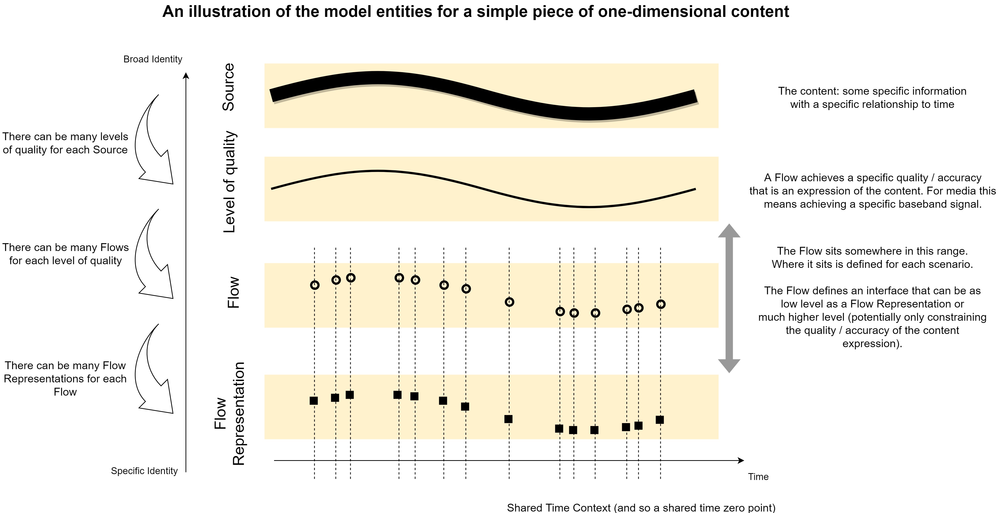
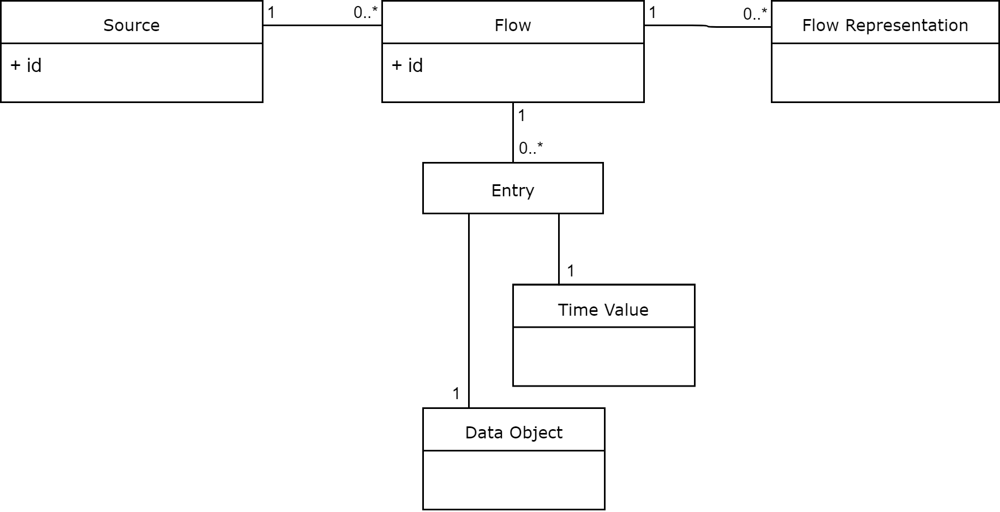

# Identity and Timing Model

[←Identity and Timing Model ](2.0._Identity_and_Timing_Model.md) · [ Index↑ ](..) · [Explanation - Source→](2.2._Explanation_-_Source.md)

## Model Summary

Building on the [JT-NM Reference Architecture](http://www.jt-nm.org/RA-1.0/), the model uses `Source`s and `Flow`s.

A `Source` (identified by a `Source` ID) is an easy and convenient way to refer to a specific piece of time-based content (some specific information with a specific relationship to time) in a manner that is agnostic to:

* the means used to express / communicate it (for example, multiple different video codecs might be used for one `Source`).
* the exact quality / accuracy of the expression.
* the exact placement of data at points in time (for example, multiple different video frame rates might be represented by a single `Source`).

A `Flow` (identified by a `Flow` ID) provides a way to refer to a specific expression of a `Source`. Each `Flow`:

* contains data of a specific data type. That is, the data is encoded (and must be interpreted) in a specific way (for example, a `Flow` might use a specific video codec with a specific configuration).
* places the data at a specific set of points in time.

* achieves a specific quality / accuracy of expression of the `Source`.

In summary, a `Flow` defines a timed-data interface to be used when handling the data. This interface might be implemented in different ways: for example, using different containers or transports for the interchange of the data. These different implementations are called `Flow Representation`s.

The diagram below illustrates an example of the progression from `Source` to `Flow Representation` in terms of an increasingly specific representation of some content:

The diagrams below illustrate examples of the progression from `Source` to `Flow Representation` in terms of the hierarchy of representation:

## Model Definitions

The main entities of the model and their relationships are summarised by the following UML class diagram:

****

### Timing (including `Time Value`s)

Time in the model is assumed to be linear.

A `Time Value` is a precise (zero duration) instant in time. A `Time Value` is measured in seconds relative to a zero\-point (note: this does not need to be an integer number of seconds).

A `Time Context` establishes a common zero-point: within a specified `Time Context` all events at a given `Time Value` are considered to be synchronised.

[Further explanation is provided about timing](2.5._Explanation_-_Timing.md)

### `Flow` (including `Data Object`s and `Entry`s)

A `Flow`:

* has an ID.
* consists of zero or more `Entry`s. Each `Entry` associates a `Time Value` with a `Data Object`.

Additionally:

* All of the `Data Object`s in a `Flow` have the same data type. That is, for all of the `Data Object`s in a `Flow` the same means of encoding (and also interpreting) the data is used.
* All of the `Time Value`s are in the same `Time Context`.

[Further explanation is provided about `Flow`s](2.3._Explanation_-_Flow.md)

[Notes on the relationship between Grains and `Entry`s](4.0._Appendix_-_Commentary.md#address-mapping-of-the-identity-and-timing-model-to-grains)

### `Flow Representation`

* A `Flow Representation` is a concrete implementation of exactly one `Flow`. It is a practical communication of the `Data Object`s and `Time Value`s defined by this `Flow`.
* For a `Flow`, any differences in the data communicated by its `Flow Representation`s must be considered negligible for the intended purpose.

[Further explanation is provided about `Flow Representation`s](2.4._Explanation_-_Flow_Representation.md)

### `Source`

* A `Source` has an ID.
* Each `Flow` is an expression of exactly one `Source`.
* All the `Flow`s that are expressions of a `Source`:
  * "appear the same" when rendered / decoded (other than differences in quality / accuracy).
  * use the same `Time Context`.

[Further explanation is provided about `Source`s](2.2._Explanation_-_Source.md)

[←Identity and Timing Model ](2.0._Identity_and_Timing_Model.md) · [ Index↑ ](..) · [Explanation - Source→](2.2._Explanation_-_Source.md)
