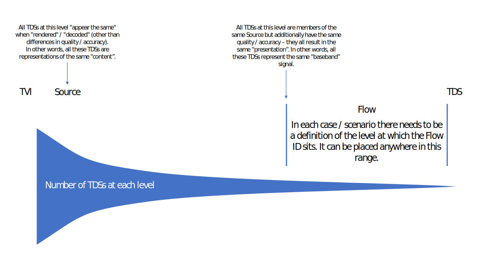

# The `Flow` &ndash; defining & understanding it

## Summary



## Purpose of a `Flow`

There is a need to work across a very wide range of different scenarios (involving media and "data" &ndash; all kinds of `Time Varying Information`). Across these scenarios there are practical reasons for handling data at different "levels". In some scenarios, the sequences of bytes used to represent the data are of interest and this is the level we principally want to work at. In other scenarios, these sequences of bytes are not of interest and we principally want to handle the data at a higher (more conceptual) level. So, the lowest level that is "interesting" is at a different position in each scenario (at least for most "common" operations) .

The need to handle data at different "levels" is illustrated in these simple examples:

1. A `TVI` consists of a numeric value that varies over time. This `TVI` is represented by integers associated with time-points.
   * We expect the integers to be carried in different formats (such as JSON, XML, plain text, binary, etc) on different transports and APIs etc. The format is known in each carriage (the format is pre-defined, signalled or requested) and it is straightforward to match the format in each case with a suitable "decoder".
   * These different formats used to carry the integers are not generally of interest to the consumer of the data &ndash; the expectation is that the data will be "decoded" and all operations carried out on the integers.
2. A `TVI` consists of a video signal. This `TVI` is represented using lossy compression (each video frame is a sequence of bytes generated by a video encoder).
   * Many operations need to be performed without decoding the video due to the cost of this. Therefore, the encoded data is of interest.
   * Also, there are often complexities and subtleties involved in the video encoding process that would not be practical to fully describe (such as with technical metadata) but which do have an impact on how the encoded data can be used or the ability of a device to decode it. This too makes the encoded data of interest, and it is useful to be able to identify representations of the `TVI` that are encoded in a particular way.

The intention is that a `Flow` ID provides a simple way to identify a specific representation of a `TVI` at the "level" that is most practical for the scenario &ndash; this is the lowest level that is considered "interesting" for the scenario. Defining a `Flow` to be at a lower level would result in additional `Flow` IDs: this allows each representation to be more precisely identified but of course means that there are additional IDs to manage; and by definition these additional IDs do not identify representations that differ in any "interesting" way.

## `Flow` defines an "interface" which may have multiple "implementations"

In effect, setting the level of a `Flow` for a scenario defines the "interface" that will be used for the data &ndash; it defines the "data type" to be used when handling the data. This "interface" may be "implemented" in different ways: for example, using different formats, containers or transports for the interchange of the data. These "implementations" can take different approaches to managing these practicalities &ndash; for example:

* The details of how data is formatted may be governed by a particular API, transport or container.
* The formatting may be explicitly signalled in-band using technical metadata properties.
* An implementation (such as an API) may provide a means for the client to request that the data be formatted in a particular way.

## Defining `Flow` as a named `Similarity Cluster`

### Approach

One way to define a `Flow` is as a "named" `SC` &ndash; this is helpful because it provides a "concrete" definition to work with.

### A reminder about Similarity Clusters

A `Similarity Cluster` (`SC`) allows us to define an ID for a collection of `TDS`s that are to some degree similar (they must all be associated with a single `Time Varying Information`).

This is convenient because it is then easy to refer to the entire collection &ndash; we just need to use one ID.

An alternative would be, say, to traverse a web of ancestry relationships between `TDS`s &ndash; possible but not very convenient.

Further, we say that all `TDS`s that are members of a `SC` have the same `Time Context` so it is then possible to easily reference time-points within these `TDS`s in a consistent way.

### `Flow` definition

A `Flow` is defined by the following statements:

* A `Flow` is a `Similarity Cluster`
* All the `TDS` members of a `Flow`:
  * are members of the same `Source`
  * are representations of (almost) the same quality / accuracy (in other words, these `TDS`s all: result in the same "presentation"; represent the same "baseband" signal)
  * comply with the restrictions, if any, given by the definition of the "level" of `Flow` for the scenario (such as restrictions on "format")
  * have `Data Object`s at the same time-points
  * belong to no other `Flow`

Notes:

* The "(almost) the same quality / accuracy" constraint allows `TDS`s with very small differences in "baseband" signal to be members of the same `Flow`. For example, if a lossy video compression process with a fixed configuration processes a video twice the `TDS`s produced may not decode to identical "baseband" video signals for various reasons (such as random processes used in the video encoder) &ndash; however, as long as these differences are "negligible" then these `TDS`s could still be members of the same `Flow`.

* There is no constraint that requires the properties of the "presentation" / "baseband" to be static. For example, the dimensions of a video or its framerate could change over time &ndash; but these properties would change in the same way across all `TDS`s that are members of a `Flow`.

* Across the `TDS` members of a `Flow` the `Data Object`s will be at the same time-points but not necessarily the same `Time Value`s (not least because different `time_unit`s may be used). Note that the intent is to restrict the time-points at which a member `TDS` can *potentially* have `Data Object`s rather than to constrain all member `TDS`s to be populated with `Data Object`s over the same period of time. The following example scenarios illustrate how `TDS` members of a `Flow` may use different means to indicate the same time-points:

  * Example 1 &ndash; A `TDS` may locate a `Data Object` in time as follows:

    * A count of 2 is provided
    * The units are given as 1/48000 seconds

  * Example 2 &ndash; A `TDS` may locate a `Data Object` in time as follows:

    * A count of 42 is provided
    * The units are given as microseconds
    * The "media rate" is indicated to be 48kHz
    * Systems are required to take into account the "media rate" when determining the precise time-point at which a `Data Object` is located &ndash; the `Data Object` is considered to be located at the closest media-rate "tick"

  * In Examples 1 & 2 the `Data Object`s are at the same time-points. Therefore, these two `TDS`s could be members of the same `Flow`. Note that if the "media rate" in Example 2 is not taken into account then the `Data Object`s are at slightly different  time-points (41.666… vs 42 microseconds) and so the two `TDS`s cannot be members  of the same `Flow`.
  * Example 3 &ndash; A TDS may locate a Data Object in time as follows:

    * A count of 4 is provided
    * The units are given as 1/96000 seconds

  * The `TDS` in Example 3 can always  be a member of the same `Flow` as the `TDS` in Example 1. The time units are different but the `Data Object`s are located at the same time-points.

* For the purposes of these statements, a `TDS` is considered to "belong", or be a "member" of, a `Similarity Cluster` even if it is only an "indirect" member. For example: `SC1---SC2---TDS1` &ndash; here `Similarity Cluster` "2" is a member of `Similarity Cluster` "1" and so `TDS` "1" is also considered to "belong", or be a "member" of, `Similarity Cluster` "1".
  * Therefore, no `TDS` belongs to more than one `Flow`, either "directly" or "indirectly".
  * Similarly, no `Flow` belongs to another `Flow`, either "directly" or "indirectly" (in other words, `Flow`s cannot be "nested").

* A consequence of these constraints is that a `Flow` can always be considered as a member of a `Source`.

## Defining `Flow` without reference to `TDS`

### Approach

As explained above, setting the level of a `Flow` for a scenario defines the "interface" that will be used for the data &ndash; it defines the "data type" to be used when handling the data.

If a `Flow` is defined as a `Similarity Cluster`, then it has `TDS` members which are all different byte-stream representations of the same "interesting" data.

An alternative is to define `Flow` without reference to `TDS`s. Instead, a `Flow` could be defined as being directly composed of timed pieces of data of a particular "data type". For example, in audio, each piece of data might be a 24-bit audio sample; in video, it might be composed of rectangular arrays of 10-bit video component samples.

### Definition

A `Flow`:

* has an `ID`
* uses a `Time Context`
* consists of zero or more entries, each of which associates a time-point with a piece of data

Additionally:

* All of the pieces of data in a `Flow` have the same "definition" / "data type"

Note: Each piece of data might have a "range" of values associated with it: values in this range are all regarded as having a variation in quality / accuracy that is negligible for the scenario (in other words, the range of values: results in the same "presentation"; represent the same "baseband" signal)

The "definition" / "data type" of a piece of data in a `Flow` could be expressed in a similar way to a C++ class, for example:
```
YuvFrame10bit1920x1080 {
  const unsigned int width = 1920;
  const unsigned int height = 1080;
  uint10 Y [width * height];
  uint10 U [(width * height) / 2];
  uint10 V [(width * height) / 2];
}
```
This should not be taken to imply that an implementation will provide the data in this format; it is merely a statement of the data that could be derived from whatever the implementation actually returns. The `const` declarations could be regarded as part of the technical metadata of the `Flow`.


## Commentary on how `Flow` is defined and interpreted

In general, it is important not to think of a `Flow` as something that is stored in a file or carried in network packets &ndash; that is a `TDS` and is just one practical realisation of the `Flow`. The `Flow` ID carried along with, or associated with, this `TDS` is of importance here &ndash; it is this `Flow` ID that identifies the content and the "interface" (and so communicates what you can expect when handling the data). It will help to inform you about how the data can be handled (for example, perhaps it makes sense to switch between `TDS`s of the same `Flow`; or maybe it is expected that a decoder can handle all `TDS`s of the same `Flow`; or maybe the interface implementation will inherently use a particular `TDS`).

In general, the `TDS`s associated with a `Flow` will not be identical. Some of the differences might be signalled by technical metadata whereas others might not. Note that none of the `TDS`s is considered to be canonical.

A `Flow` may be requested from a system using a `Flow` ID. The expectation is often that a single `TDS` will be delivered throughout the resulting communication / transportation "session" even though there may be other `TDS`s associated with the same `Flow`.

It is typically important for technical metadata to be provided about a `Flow`. This "`Flow` metadata" will apply to all `TDS`s associated with the `Flow` (some `TDS`s may have extra `TDS`-specific technical metadata associated with them). Additionally, it is important that the "level" of the `Flow`, i.e. the definition of the "interesting" data in the `Flow`, is clearly defined &ndash; this "level" might also need to be communicated between devices using additional metadata properties.

Even if `Flow` is set (for a particular scenario) at a much higher "level" than `TDS`, this does not mean that all "levels" below `Flow` are unimportant. The "levels" below that defined by the `Flow` are not considered interesting when "interfacing" with the data but they do need to be taken care of somewhere in the wider system; that is, these lower "levels" are critical to a successful data transfer but are not of interest once that transfer has completed.

## Examples

### Mono PCM audio in different packaging formats

In this example, we use a `Flow` ID of X to represent this audio encoded as PCM. In this scenario the `Flow` is set at the "level" of the PCM-coded audio samples (these are endianness-independent).

The same `Flow` ID is used across a variety of packaging / delivery mechanisms.

RTP:

* PCM in RTP is defined to be big endian

WAV:

* PCM in WAV is defined to be little endian

Store:

* Deliver the PCM audio along with signalling of the endianness so that endianness can be signalled upon retrieval

HTTP API:

* Deliver the PCM audio over the API along with signalling of the endianness. Alternatively, define a fixed endianness for the API (and specify it in the API documentation).

C++ function:

* Returns samples as integers; the endianness of the in-memory representation is transparent to the user.

`Flow` technical metadata would include properties such as the audio codec (PCM), sampling rate, bit-depth, but not the endianness.

### Uncompressed video

In this example, we use a `Flow` ID of X to represent this uncompressed HD video. In this scenario the `Flow` is set at the "level" of the uncompressed video frames (these are byte-packing independent). Note: in this example, if the video were losslessly compressed (for example using VC-2 in a lossless mode) then a different `Flow` ID would be used.

The same `Flow` ID is used across a variety of packaging / delivery mechanisms. 

RTP (RFC 4175 or SMPTE ST 2110):

* Uncompressed video frames have a defined line-based byte packing arrangement

HD SDI (video carriage):

* Uncompressed video frames are carried in raster sequence using 10-bit words. In this example, the client should assume that only the "active" area (1920x1080) is relevant and so discard the rest of the video samples in the HD SDI signal.

C++ function:

* Returns video frames as planar with each 10-bit sample carried in a 16-bit integer.
* Alternatively, returns video frames with the 10-bit samples packed into bytes. 
* In both cases, the format is defined in the function documentation. 

HTTP API:

* Deliver each video frame as a binary object over the API along with signalling of the byte packing (such as v210 or planar). Alternatively, define a fixed byte packing for the API (and specify it in the API documentation).

Store, MXF file, or similar:

* [Same situation as for HTTP API above]

`Flow` technical metadata would include properties such as: 1920x1080, YUV, 10-bit, 4:2:0, colour space but not the byte packing.


### AVC Intra

In this example, we use a `Flow` ID of X to represent this AVC Intra coded video. In this example, we assume that each video frame is encoded only once by one encoder (with one set of settings) across all the `TDS`s with a `Flow` ID of X.

In this scenario the `Flow` is set at the "level" of these compressed video frames. More specifically, all the member `TDS`s are such that only "bitstream assembly" operations need to be carried out to create an AVC Intra compliant bitstream (or the bitstream is already compliant).

The same `Flow` ID is used across a variety of packaging / delivery mechanisms.

RTP (RFC 6184):

* The H.264 padding and filler are removed from the bitstream prior to carriage; SPS/PPS placement or repetition may be altered to suit the transmission; etc

MXF &ndash; example 1:

* Carried as AVC Intra (strictly following the AVC Intra specification &ndash; for example, each video frame is padded to be an exact size). Signalled in the MXF Header Metadata as AVC intra

MXF &ndash; example 2:

* Carried as generic H.264 (for example, variable video frame size). Not signalled in the MXF Header Metadata as AVC Intra.

HTTP API, Store, etc:

* Deliver each video frame as a binary object along with signalling of the encoding (either simply "H.264" or "AVC Intra", as appropriate)

MP4 file (H.264 mapped as per ISO/IEC 14496-15):

* The H.264 padding and filler are removed from the bitstream prior to carriage; the SPS/PPS are moved to the MP4 header; etc


### Lossy compression in a cloud environment (distributed encoders etc)

In this example, we use a `Flow` ID of X to identify the `TDS`s that can be used interchangeably subject to a set of defined rules.

For example, this could be useful for:

* On-the-fly encoding of content without storing the result. The result may be different each time the encoded content is requested.
* Distributed encoders. The final encoded result might be assembled from multiple encoders running in parallel. These encoders may not produce identical reasons, for example because: there is a random aspect to the encoding; the encoding produced is affected by the frames that have already been encoded; the different encoders may be optimised for different types of content.

The assumption is that the "baseband" signal is virtually identical in each case so the `TDS`s can belong to the same `Flow`, but the properties of the encoding itself may be quite different. However, in this example the encoders are configured and operated to ensure that the encodings can be used interchangeably subject to a set of defined rules. For example, GOP placements may be restricted so that `TDS`s can be safely switched between at known intervals. In general, these rules should enable the client to answer questions such as:

* Can an encoded frame from one encoder be *replaced* with one from another encoder?
* Can one section of content encoded by encoder A be joined to the next section of content encoded by encoder B?

### Temperature readings

In this example, a temperature sensor generates readings regularly. Each reading is a 32-bit signed-integer. We use a `Flow` ID of X to identify these 32-bit signed-integer readings. In this scenario the `Flow` is set at the "level" of the 32-bit signed-integers (and so there are no restrictions on the format etc of the data).

The same `Flow` ID is used across a variety of packaging / delivery mechanisms.

C++ function:

* Returns the temperature reading for a given time-point. The return value is `int32`; the endianness of the in-memory representation is transparent to the user.

HTTP API:

* The API has an end-point allowing the temperature reading to be requested at a specified time-point. The API response could be JSON (different schemas are possible, such as: `{ "temperature": 32 }` or `{ "t": 32 }`) or XML or another format. The format may be specified in the API documentation, or signalled in the API response, or could be requested by / negotiated with the client (perhaps using HTTP content negotiation headers)

File:

* The data may be stored in various different file formats, such as a MATLAB file or a Python pickle file. The format of the file will need to be defined and signalled.

### Weather observations (alternative 1)

In this example, a weather station makes weather observations regularly (from a number of sensors). The details of each observation are stored in a JSON data structure using JSON Schema Y. We use a `Flow` ID of X to identify these JSON-formatted weather observations. In this scenario the `Flow` is set at the "level" of the JSON-formatted (using Schema Y) weather observations (these are independent of details of the serialisation).

The following would all have the same `Flow` ID:

* The JSON is encoded as UTF-8

* The JSON is encoded as UTF-16
* Different amounts of superfluous whitespace are included
* Different orderings of JSON dictionary keys are used

Note:

* If a different JSON Schema (or another format such as XML) is used then a different `Flow` ID is required.

### Weather observations (alternative 2)
In this alternative we define `Flow` at a higher "level" &ndash; we say that `Flow` is at the level of the weather observations themselves and so the same `Flow` ID is used regardless of format (XML, different JSON Schemas, etc).

The data contained within each observation can be expressed as:

```
WeatherObservation {
  int16 temperature;
  uint16 humidity;
}
```

The same `Flow` ID is used across different implementations of this interface.

C++ function:

* Returns each weather observation as a struct as defined in the function documentation.

HTTP API:

* The API has an end-point allowing the weather observation to be requested at a specified time-point. The API response could be JSON (different schemas are possible, such as: `{ "temperature":20, "humidity":50 }` or `{ "t":20, "h":50 }`) or XML or another format. The format may be specified in the API documentation, or signalled in the API response, or could be requested by / negotiated with the client (perhaps using HTTP content negotiation headers)

