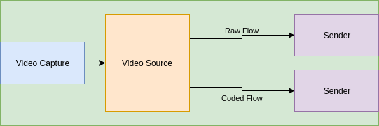
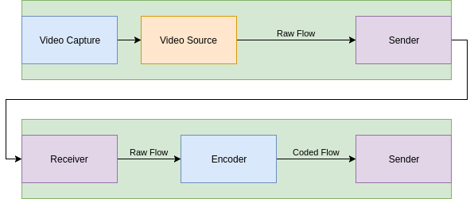

# The `Source` &ndash; defining & understanding it

## Purpose of a `Source`

The `Source` entity is defined so that it is easy and convenient to refer to time-based signals or "content" in a manner that is agnostic to the "format" used to represent it. If statements about a time-based signal are made using a `Source` ID then it is clear that those statements apply to all `TDS`s associated with the `Source`.

It is important that `Source` is defined so that it is practically useful, aids in interoperability, and in many common scenarios can be assigned / managed automatically. Therefore, it is helpful for a `Source` to have a clear and focused definition. This allows a `Source` ID to be used in establishing a clear "contract" between devices, users, etc for example when designing an API.

## Defining Equivalence

The degree to which content can be modified and still be considered to have the same identity has been considered through the definition of Similarity Clusters and the exploration of common production operations. As this exercise has resulted in 'grey areas' it is useful for us to re-examine the user stories relating to content equivalence to aid in our future decisions.

### User Stories

* AS A broadcaster I NEED TO automatically combine various combinations of video, audio and data with appropriate synchronization to support a range of different audience needs (platform, language, accessibility, etc.) SO THAT I maximize the value of my content.
* AS A content producer I NEED TO be sure my content can be rendered correctly in different forms (picture size, qualities, aspect ratio, HDR/SDR, conventional/3D/VR, etc.) with correct synchronisation between the video, audio and data elements SO THAT the quality of my output is not compromised on some platforms.
* AS A content producer I NEED TO identify live or stored video, audio and data elements independent of their format SO THAT I know that different representations of the same content are editorially equivalent
* AS A content producer I NEED TO differentiate between representations of the same content SO THAT I can ensure that the appropriate format is selected for the operations I want to perform
* AS A content producer I NEED TO make composition decisions against a locally available rendition and have those decisions enacted on the corresponding remotely available content SO THAT I can save on the cost of sending production staff to remote events.

### Analysis

Broadly speaking, these user stories can be distilled into the following:

* Identifying that content is in some way equivalent
* Performing synchronisation for presentation across alternative content
* Performing common processing actions across equivalent content

A key factor to extract from these cases is the differing intent of the 'content processing' (ie. creative) and 'content presentation' (ie. post-processing) phases of a given production chain. The core processing phase requires stronger content equivalence in order for it to have the desired creative output. The presentation phase is far more bound by the technical constraints of the distribution chain or presentation devices, and as such a broader set of alternative representations may be acceptable (or desired).

Taking the example of a Video Crop operation which was identified as a 'grey area', this is commonly used as a presentation function to perform aspect ratio conversions. Whilst this is acceptable at this stage of the production chain, it would be unacceptable if a studio's primary output switched to a cropped output mid-way through a programme because the system identified it as an 'equivalent' TDS.

This is an indicator that there may be a requirement for multiple levels of recognised equivalence. However, for the 'common processing' user stories to be achievable at all, there must be a named Similarity Cluster at that more constrained level, which it is proposed be the Source. This would result in the following operations being considered as having the same Source ID:

* Audio / Video Bit Depth Modification
* Chroma Subsampling Modification
* Byte Packing Modification
* Colorspace Conversion
* Colour Encoding Conversion
* Video Resolution Modification
* Sample Rate Conversion
* Encode / Decode

## Defining `Source` as a named `Similarity Cluster`

### Approach

One way to define a `Source` is as a "named" `SC` &ndash; this is helpful because it provides a "concrete" definition to work with.

The following use cases have been synthesised from the above user story analysis to help in producing a focused definition of a `Source`:

* AS A person editing a video programme I NEED TO express my edit decisions SO THAT whichever representations of the programme are generated it will appear as I intended (I accept that these representations may be of different qualities for practical reasons)
* AS A user of a music API I NEED TO discover the different available representations of a recording SO THAT I can choose the most practical representation for the device I am using at the time
* AS A device that creates `TDS`s I NEED TO know how to assign each `TDS` to a `Source` SO THAT users are able to discover the `TDS`s that they require

 ### A reminder about Similarity Clusters

A `Similarity Cluster` (`SC`) allows us to define an ID for a collection of `TDS`s that are to some degree similar (they must all be associated with a single `Time Varying Information`).

This is convenient because it is then easy to refer to the entire collection &ndash; we just need to use one ID.

An alternative would be, say, to traverse a web of ancestry relationships between `TDS`s &ndash; possible but not very convenient.

Further, we say that all `TDS`s that are members of a `SC` have the same `Time Context` so it is then possible to easily reference time-points within these `TDS`s in a consistent way.

### `Source` definition

A `Source` is defined by the following statements:

* A `Source` is a `Similarity Cluster`
* All the `TDS` members of a `Source`:
  * "appear the same" when "rendered" / "decoded" (other than differences in quality / accuracy)
  * belong to no other `Source`

Notes:

* The "appear the same" constraint means, for example, that differences in "format" (e.g. video codec) between `TDS` members of a `Source` are permitted. However, differences that result in a variation in the time-based data are not permitted unless these are only differences in "quality" (e.g. due to lossy compression). Relating it back to the first use case listed above: none of the `TDS`s belonging to a `Source` introduce changes that a user of a video editing tool would find "surprising"; none of the changes relate to properties or operations that the user would change for "creative" reasons; changes relate only to the technical properties of the format / representation, and only in ways that merely affect the "quality".
* There is no constraint that all `TDS`s satisfying these conditions _must_ be part of the same `Source` &ndash; this constraint would not be practical to enforce. However, clearly a `Source` is most useful if all eligible `TDS`s are members.
* There is no constraint on the `Time Value`s used in the `TDS`s belonging to a `Source`. For example, these `TDS`s may not all use the same video sample rate. There appears to be no user story justifying treating this time-based property of the representation differently to any other property of the representation / format. Also, consider that for some audio codecs the "sample rate" is only decided upon decode.
* A `Source` may have zero `TDS` members. This may be practically useful because a `Source` may be created before its member `TDS`s; when this `Source` is initially created there may be a description of the nature of the `TDS`s that it will contain. Also, as described in the "commentary", a `Source` can have meaning / utility independently of its `TDS` members and so having a `Source` with zero `TDS` members (at least initially) can be meaningful.
* For the purposes of these statements, a `TDS` is considered to "belong", or be a "member" of, a `Similarity Cluster` even if it is only an "indirect" member. For example: `SC1---SC2---TDS1` -- here `Similarity Cluster` "2" is a member of `Similarity Cluster` "1" and so `TDS` "1" is also considered to "belong", or be a "member" of, `Similarity Cluster` "1".
  * Therefore, no `TDS` belongs to more than one `Source`, either "directly" or "indirectly".
  * Similarly, no `Source` belongs to another `Source`, either "directly" or "indirectly" (in other words, `Source`s cannot be "nested").

## Commentary on how `Source` is defined and interpreted

Other approaches to defining and explaining `Source` may be helpful in certain scenarios or for readers approaching the field from different perspectives.

It is useful to appreciate that a `Source` represents what its member `TDS`s have in common &ndash; that is, the time-based data that they all represent. Depending on how the associated `TVI` is defined, the `Source` may well represent the `TVI` in its entirety. The `Source` entity allows the content to be referred to without needing to refer to a specific `TDS`. 

In some scenarios it may be helpful to think of the `Source` as identifying the result of running a particular query on the ancestry relationships associated with some `TDS`s. In this way, the `Source` can be seen as representing the commonality between a group of `TDS`s.

Broader definitions of `Source` were considered (that is, definitions that would permit more `TDS`s to be members) but these were found to be problematic when analysing user stories:

* If greater changes are permitted to the content represented by `TDS`s within a `Source` (such as converting a colour image to monochrome or allowing a crop of a video) then it becomes more difficult to define the "boundary" of a `Source`. A `Source` becomes less reliable as a contract for interoperability.
* It would be possible to say that any `TDS` can be a member of a `Source` as long as the manner in which it differs is signalled in the technical metadata of the `TDS`. However, this technical metadata could potentially be very complex (to support the description of very complex content alterations) and not supported by all devices. Also, when a device is creating a `TDS` and deciding which `Source` it should belong to it is probably unaware of the technical metadata that will be made available along with that `TDS` in all scenarios (e.g. it may be available through a number of different APIs). 

## Device Agnosticism

Typically the `Source` may indicate that the `TDS`s have all originated from the same production device (e.g. multiple coded formats of video from a camera). Consider the following however:

### Example: Raw & Coded Video

#### 1. Camera producing raw and coded output

#### 2. Camera producing raw output, and external codec

### Analysis

In both of the above operations a raw and coded `TDS` are created. However, only in example 1 do these two `TDS`s physically originate on the same device. From a content processing perspective there is no reason to treat the coded `TDS`s in these two examples any differently, and indeed we already have a way to identify that they were created on different devices via that device's own identity (see AMWA IS-04). It is therefore far more useful to have a more content-centric identifier to indicate the equivalence of these `TDS`s.

## The Case For Additional Named Similarity Clusters

With the Source defined at a specific level, there are a number of operations which remain in a grey area with regard to whether they could be considered equivalent, or even the same TVI. These are:

* Amplify / Attenuate
* Video Crop / Zoom
* Video Squeeze / Squash
* Conversion to monochrome
* EQ Modification

A further higher level Similarity Cluster could be defined to contain these where content forms part of the same TVI as a result of these operations. It is however worth considering the user story which is driving this requirement.

The primary concern regards achieving synchronisation for delivery between related content. Considering a finished programme asset, this may have a Source ID for its video and a Source ID for its audio, with a timing relationship defined between the two. Each Source ID may be associated with a number of equivalent TDSs. The desire is to maintain the synchronisation relationship between the Sources through various operations.

Typically, a delivery chain may include operations such as Encode/Decode and similar intra-Source processes. It may also however include operations such as DOG insertion, watermarking, cropping and mixing, or overlaying a sign language interpreter. These operations fundamentally change the content and as such its TVI, meaning that this relationship is not permitted to be conveyed by a Similarity Cluster.

It appears as a result that a Similarity Cluster may not be the best solution to this problem as it only permits grouping of a narrow subset of the related content. End to end timing may be sufficient to cover this case, however in the case that it is not then an ancestry based mechanism, potentially feeding into a more generic grouping construct may be necessary.
